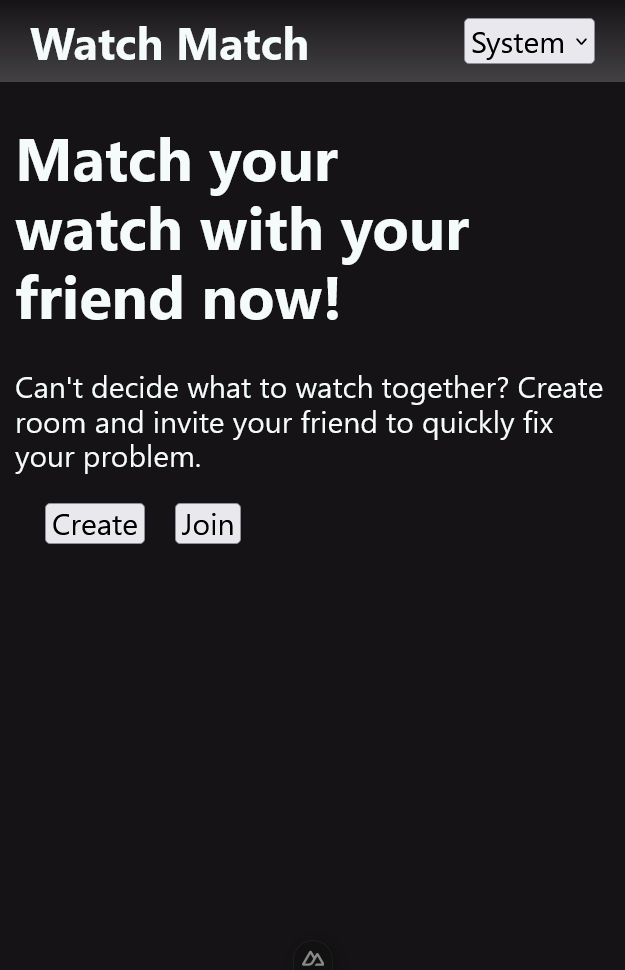
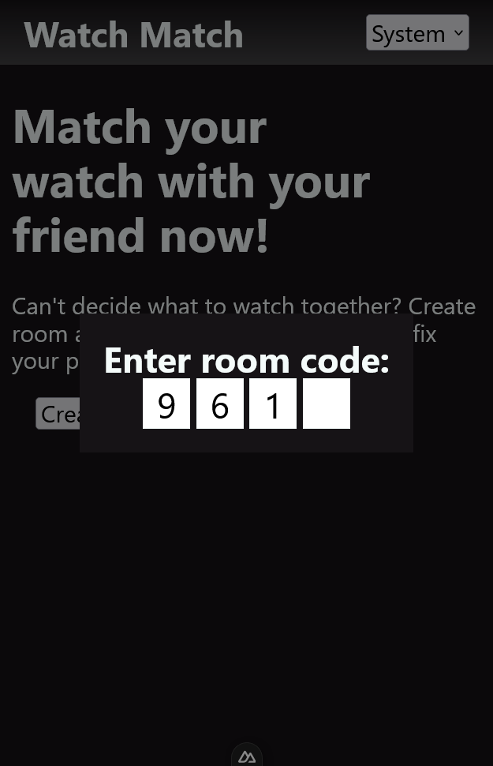
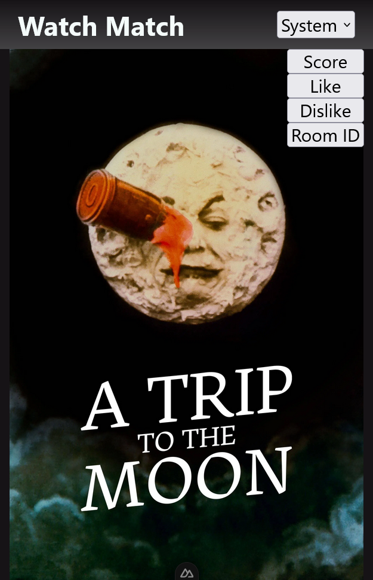
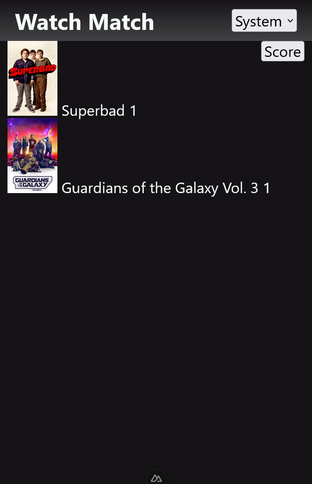

# Watch Match
Monorepository for a web application that helps people find shared interests and choose movies to watch together

## Screenshots
<p align="left">
  
  
  
  
</p>

## Features
- Instant room creation and joining without registration
- Infinite, auto-generated movie feed
- Local movie rating for each room
- `SignalR` for fast real-time communication with the server

## Configuration
### Backend
1. Set your TMDb API key
```
dotnet user-secrets set "TMDB:API_KEY" "YOUR_API_KEY"
```
2. [Optional] Set your proxy path for TMDb API with `TMDB_PROXY` environment variable
### Frontend
1. Set your backend path with `API_BASE` environment variable
